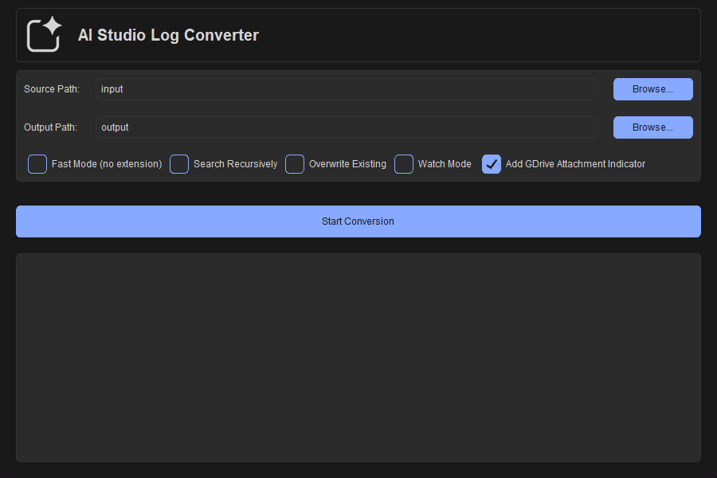

# AI Studio Log Converter

A powerful and flexible tool to convert Google AI Studio chat logs (JSON format) into well-structured Markdown (`.md`) files, perfect for knowledge bases like Obsidian. It intelligently handles various data formats, extracts metadata, saves embedded images, and is highly customizable.



## Features

- **✨ Modern GUI:** A clean, user-friendly graphical interface built with CustomTkinter.
- **🤖 Smart Parsing:** Intelligently handles multiple JSON formats from different AI Studio versions.
- **🖼️ Image Handling:** Automatically saves `inlineData` (base64) images to an `assets` folder and creates local links.
- **🔗 Link Placeholders:** Creates clickable links for all Google Drive attachments (`driveImage`, `driveDocument`, `driveVideo`) and `youtubeVideo` references, preserving context.
- **📊 Metadata Table:** Generates a convenient Markdown table at the top of each file with key session parameters (Model, Temperature, etc.).
- **⚙️ Full Configuration:** All settings, including templates and localization, are controlled via an easy-to-edit `config.yaml` file.
- **🌐 Localization (EN/RU):** All generated headers and templates can be switched between English and Russian.
- **👀 Watch Mode:** Automatically convert files as they are added or modified in the input folder (CLI only).
- **📁 Smart Folder Structure:** Works with a clean `input`/`output` folder structure by default, which is created automatically.

## Usage for End-Users

This is the simplest way to use the converter without needing Python installed.

1.  Download the latest `.zip` archive from the [Releases](https://github.com/imKeim/AI-Studio-Log-Converter/releases) page.
2.  Extract the archive. You will get a folder with `ai-studio-log-converter.exe`, `config.yaml`, and other template files.
3.  Double-click `ai-studio-log-converter.exe` to run the graphical interface.
4.  Use the "Browse..." buttons to select your source and output folders.
5.  Choose your options using the checkboxes.
6.  Click "Start Conversion"!

### Interface Options Explained

The main window provides the following options to customize the conversion process:

*   **`Fast Mode (no extension)`**
    *   **What it does:** Significantly speeds up the scanning of the source folder.
    *   **How it works:** Instead of opening and validating every single file for correct JSON format, this mode assumes that any file *without an extension* is a Google AI Studio log. This is the default behavior for downloaded logs.
    *   **When to use it:** It's recommended to keep this enabled in most cases for maximum performance, especially if you have many files.
    *   **When to disable it:** If your log files have an extension for some reason (e.g., `.json`), or if the source folder contains other extensionless files that are not logs. **Disabling Fast Mode is also required to use the Google Drive attachment indicator feature.**

*   **`Search Recursively`**
    *   **What it does:** Searches for log files not only in the specified source folder but in all of its subfolders as well.
    *   **When to use it:** Useful if your logs are organized into a complex folder structure.

*   **`Overwrite Existing`**
    *   **What it does:** Determines what happens if a Markdown file with the same name already exists in the destination folder.
    *   **How it works:** If enabled, the existing file will be replaced with the new one. If disabled, the existing file will be skipped, and the conversion for that log will not be performed.
    *   **When to use it:** Enable this if you have updated the source logs and want to regenerate the Markdown files for them.

*   **`Watch Mode`**
    *   **What it does:** Runs the converter in a background mode to process files automatically.
    *   **How it works:** The application will continuously monitor the source folder. As soon as a new log file is added or an existing one is modified, it will be converted automatically.
    *   **Important Note:** In the GUI, this option is mainly for demonstration. For stable background operation without a visible window, it is recommended to use the command-line launch with the `--watch` flag, as described in the [Running in the Background](https://github.com/imKeim/AI-Studio-Log-Converter#running-in-the-background-hidden-mode) section.

## Running in the Background (Hidden Mode)

To run **Watch Mode** silently without a visible console window, you can create a simple helper script.

1.  **Create a new text file** in the same folder as `ai-studio-log-converter.exe`.
2.  **Paste the following code:**
    ```vbscript
    Set WshShell = CreateObject("WScript.Shell")
    WshShell.Run "ai-studio-log-converter.exe --watch", 0, false
    ```
3.  **Save the file** with a `.vbs` extension (e.g., `start_watch_hidden.vbs`).

Now, you can double-click the `.vbs` file to launch the converter silently. To stop it, use the Task Manager (`Ctrl+Shift+Esc`) to end the `ai-studio-log-converter.exe` process.

## For Developers

### Prerequisites
- Python 3.8+

### Setup
1.  Clone the repository:
    ```bash
    git clone https://github.com/imKeim/AI-Studio-Log-Converter.git
    cd AI-Studio-Log-Converter
    ```
2.  Install the required dependencies:
    ```bash
    pip install -r requirements.txt
    ```
3.  Run the application:
    ```bash
    # To launch the GUI (default)
    python ai-studio-log-converter.pyw

    # To launch the interactive CLI
    python ai-studio-log-converter.pyw --cli
    ```

## Building the Executable

### Method 1: Using the Build Script (Recommended for Windows)

The easiest way to build the application on Windows is to use the provided batch script.

1.  Install all development dependencies:
    ```bash
    pip install -r requirements-dev.txt
    ```
2.  Simply double-click the `build.bat` file.

The script will automatically install all dependencies, run PyInstaller with the correct options, and clean up temporary files.

### Method 2: Manual Build

1.  Install all dependencies:
    ```bash
    pip install -r requirements.txt
    pip install -r requirements-dev.txt
    ```
2.  Run the build command from the project root:
    ```bash
    python -m PyInstaller --onefile --windowed --name "AI-Studio-Log-Converter" --icon="logo.ico" --add-data "src/custom_theme.json;." --add-data "logo.ico;." --add-data "logo.png;." "ai-studio-log-converter.pyw"
    ```
3.  The final `AI-Studio-Log-Converter.exe` will be in the `dist` folder.

## Testing

The project uses `pytest` for automated testing to ensure code quality and prevent regressions.

1.  Install all development dependencies:
    ```bash
    pip install -r requirements-dev.txt
    ```
2.  Run the tests from the project root directory:
    ```bash
    pytest
    ```

## Configuration

The converter is fully customizable via the `config.yaml` and template files, which are created automatically on the first run.

### `config.yaml`

This file controls the main behavior of the script.

```yaml
# Language for the generated Markdown files. (en/ru)
language: 'en'
# Enable/disable the YAML frontmatter block.
enable_frontmatter: true
# Enable/disable the metadata table with run settings.
enable_metadata_table: true
# Enable/disable the grounding metadata block (web search sources).
enable_grounding_metadata: true

# --- Google Drive Attachment Indicator ---
# If enabled, the converter will check for any Google Drive links in the log
# and add a visual indicator to the filename and a tag to the frontmatter.
# This feature only works when 'Fast Mode' is DISABLED.
enable_gdrive_indicator: true
gdrive_filename_indicator: '[A] '
gdrive_frontmatter_tag: 'has-gdrive-attachment'

# Template for the output filename.
# Available variables: {date}, {basename}, {gdrive_indicator}
filename_template: '{date} - {gdrive_indicator}{basename}.md'
# Date format for the {date} variable.
date_format: '%Y-%m-%d'

# Text templates for different languages.
localization:
  en:
    user_header: '## User Prompt 👤'
    model_header: '## Model Response 🤖'
    thought_block_template: |
      > [!bug]- Model Thoughts 🧠
      > {thought_text}
    system_instruction_header: System Instruction ⚙️
    system_instruction_template: |
      > [!note]- {header}
      > {text}
    metadata_table:
      header_parameter: Parameter
      header_value: Value
      model: '**Model**'
      temperature: '**Temperature**'
      top_p: '**Top-P**'
      top_k: '**Top-K**'
      web_search: '**Web Search**'
      search_enabled: Enabled
      search_disabled: Disabled
    frontmatter_template_file: frontmatter_template_en.txt
  ru:
    # ... Russian localization ...
```

### `frontmatter_template_en.txt`

This file contains the template for the YAML frontmatter.

```yaml
---
title: "{title}"
aliases:
  - "{title}"
para: resource
type: llm-log
kind: google-ai-studio
tags: 
status: archived
cdate: {cdate}
mdate: {mdate}
---
```